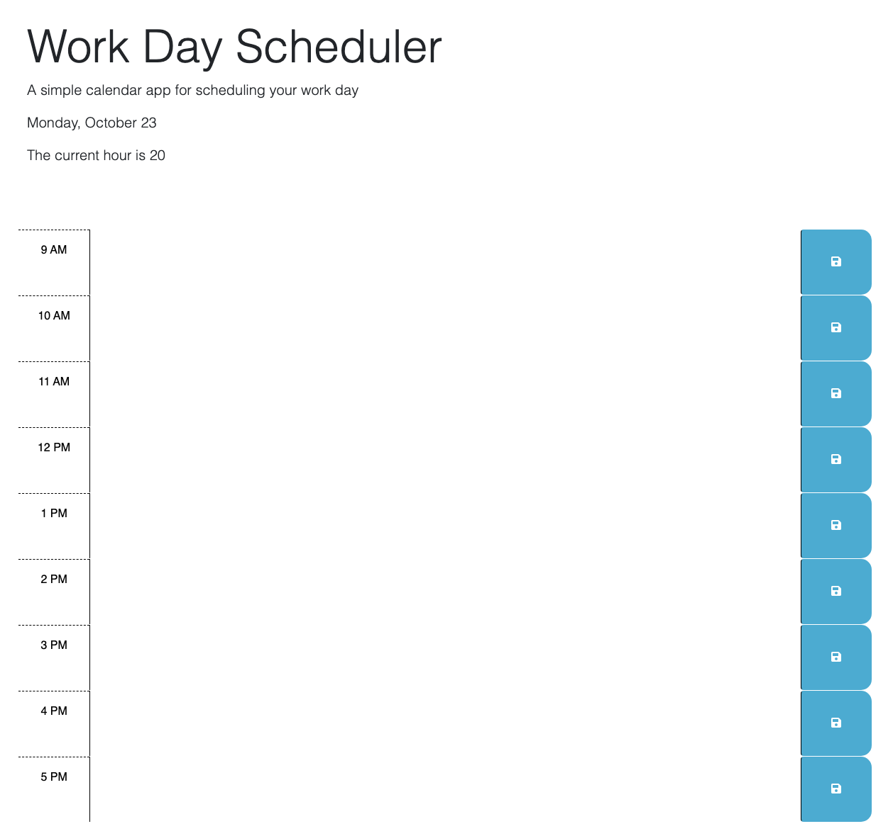

# Daily Planner Workday Scheduler

## Description

This program is created to keep working users on track with what they need to do for each hour of the day. They can enter text for each hour and click the save button to keep the text on screen after clicking the refresh button.

The program uses DayJS to get the current date and the current time and localStorage to store and get the saved tasks

I learned how to use local storage to set and get the entered text. I learned how to use DayJS to get the date and time. I learned how to connect libraries to my project, I learned how to use bootstrap.

## Usage

Deployed URL: https://ahgeak.github.io/daily_planner_workday_scheduler/

GitHub Repository URL: https://github.com/ahgeak/daily_planner_workday_scheduler

    

## Credits
I used documentation from the mdn website at: https://developer.mozilla.org/en-US/

I reviewed lessons and practice exercises on W3Shools at: https://www.w3schools.com/

I read forums on StackOverFlow at: https://stackoverflow.com/ 

I attend office hours to ask the TA about the DOM loading error that my application is experiencing

## License

This project users an MIT liscene